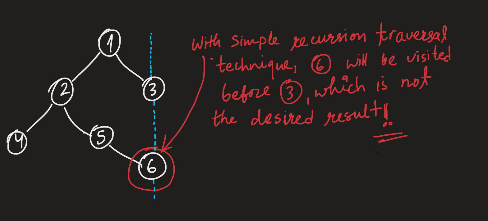

# Top View of Binary Tree

Source: [YouTube](https://youtu.be/Et9OCDNvJ78)    

Why approaching this problem with recursion is not a good idea - 


#### Implementation
```cpp
/* struct Node {
    int data;
    Node* left;
    Node* right;
}; */

class Solution {
public:
    //Function to return a list of nodes visible from the top view 
    //from left to right in Binary Tree.
    vector<int> topView(Node *root) {
        // Your code here
        map<int, int> mp; // (vertical line no., value)
        queue<pair<Node*, int>> qu;  // (node, line no.)
        qu.push({root, 0});
        
        while(!qu.empty()) {
            Node *curr = qu.front().first;
            int j = qu.front().second;  // vertical line no.
            qu.pop();
            
            if(!mp.count(j))
                mp[j] = curr->data;
            
            if(curr->left)
                qu.push({curr->left, j - 1});
            if(curr->right)
                qu.push({curr->right, j + 1});
        }
        
        vector<int> answer;
        for(auto &p: mp)
            answer.push_back(p.second);
        return answer;
    }
};
```
